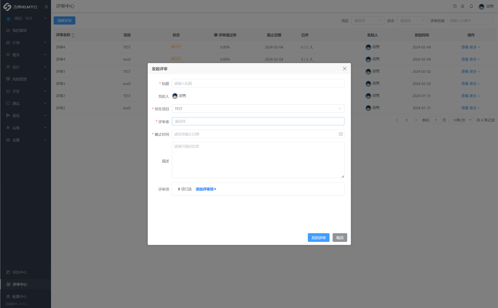
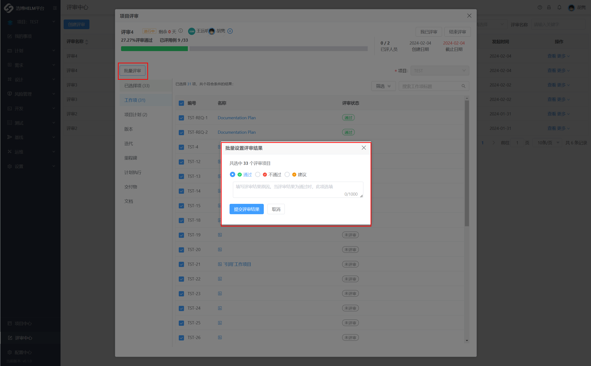

# **评审中心**

评审是项目活动中重要的复核流程。项目人员介入评审能够对齐改进意见，及时发现被个人主观忽视掉的点，交换其他人的建议，有效增加信服力。

## 4.1 创建评审

点击左侧下方导航栏 `评审中心`,进入评审管理页面。
点击右上角 `创建评审`，然后填写评审标题，圈选指定评审者（可多选）、截止日期、工作项等后发起评审。

## 4.2 发表评审意见

创建评审后，在评审列表点击该评审，即可进入评审页面。

在评审页针对各工作项发表意见。你可以给出「通过」、「不通过」、或「建议」意见，点击「发表」即可。

* 对所有工作项均已发表意见之后，你可以用以方式完成评审：
  点击页面上角「完成评审」。此时该按钮会变成「我已评审」，表示你已完成本次评审任务。

## 4.3 修改评审

在评审列表，点击更多操作按钮，选择「编辑」，即可重新选择评审人员、截至日期和工作项。

## 4.4 结束评审

在评审页面，评审发起人可以点击页面右上角「结束评审」终止该评审任务。
