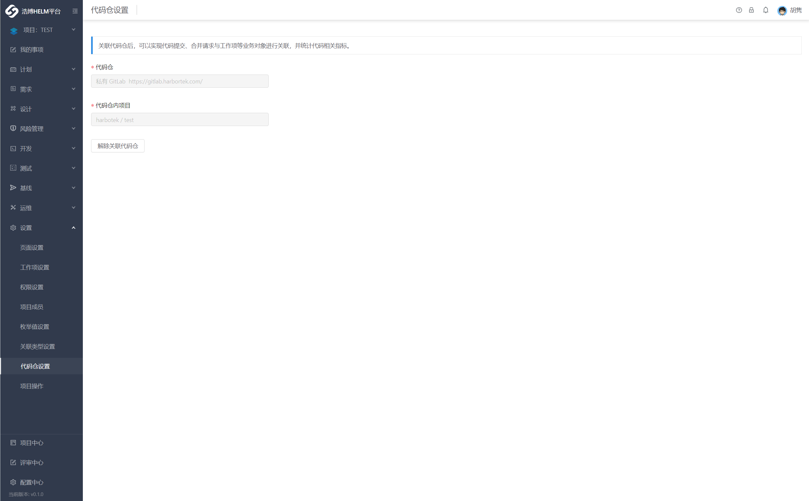
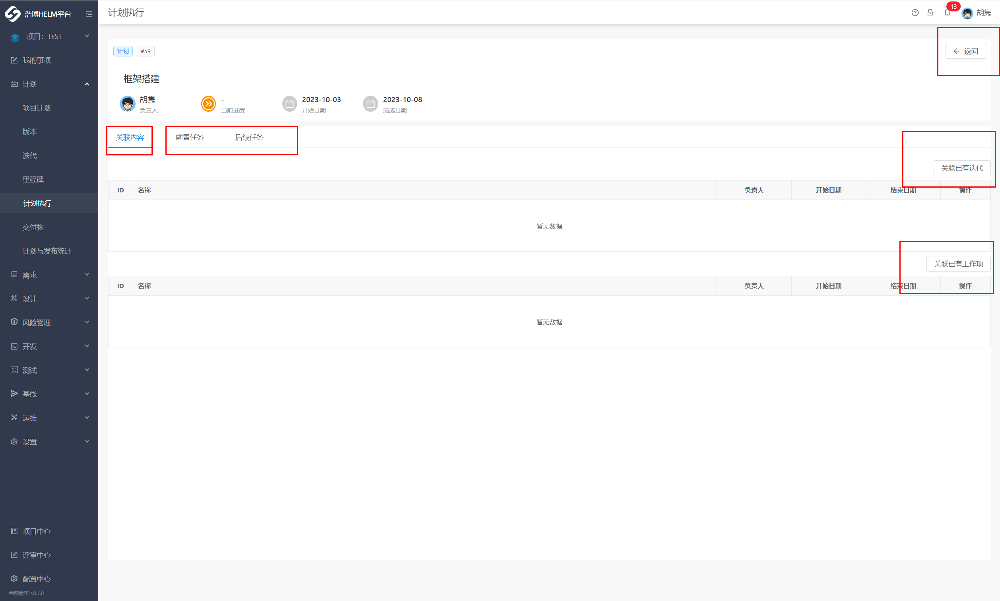

# 2. 项目管理

## 2.1 项目的创建

`新建项目` 是在 HELM 进行项目管理的第一步。在 HELM `项目中心`点击 `新建项目`， `输入项目名称（缩写）->选择模板->完成新建`。

### 2.1.1. 项目模板新建

HELM 结合不同的开发模式，内置多种个项目模板，模板内预设了常用组件、工作项类型和相关报表，通过模板新建项目后，也可根据实际情况对默认配置进行编辑和调整。

### 2.1.2 从已有项目复制

**管理流程、关键数据相同的项目，可以选择从已有项目复制，** 从已存在的项目中复制「项目组件」、「工作项类型」、「权限配置」等信息和项目数据。

#### 2.1.2.1 默认复制的数据

包含项目组件、工作项类型、权限配置、迭代配置以及项目配置，其中：

- 项目组件：包含当前项目内的组件配置、组件权限和组件设置的筛选器公共视图
- 工作项类型：包含工作项类型的工作项属性、布局、权限、工作流、通知的配置

#### 2.1.2.2 自定义复制的数据

包含工作项数据、迭代数据、项目计划、里程碑、交付物、项目成员、文件以及项目报表，其中：

- 工作项数据：可自定义复制属于某种工作项类型的数据，如仅复制「需求」。工作项复制完成后默认为初始状态，当存在子工作项时将与父工作项一同复制
- 项目计划：包含项目计划内设置的计划组和计划，当勾选里程碑后将同时复制里程碑
- 里程碑：包含里程碑内设置的目标交付物。过程中上传的交付物用户可自定义是否跟随复制。里程碑复制完成后默认为初始状态，进度为 0
- 文件：工作项内上传的附件。作为过程产物的一部分，同样支持用户自定义是否跟随工作项复制文件
- 项目成员：勾选复制项目成员时，可直接点击「创建」项目；不勾选项目成员时，需要进入下一步选择项目成员。

## 2.2 项目的配置

### 2.2.1 项目基本信息配置

项目的基本信息包括项目名称、创建者、创建时间等基本信息。在「`项目 -> 设置 -> 项目操作`中，可以看到当前项目的基本信息。

#### 2.2.1.1 修改项目名称

如需修改项目名称，可在项目名称的输入框内修改名称，并点击 `更新`，即可修改项目名称。

#### 2.2.1.2 项目复制

在 `项目操作`过程中，点击 `复制项目`，创建一个以本项目为基础的新项目，复制内容包含项目组件、工作项类型、权限配置、迭代配置以及项目配置等数据。

#### 2.2.1.3 保存为模版

在 `项目操作`过程中，点击 `保存为模版`，弹窗中编辑模板名称及描述信息，点击 `确定`，即可将本项目存储为模板，作为创建项目的模板使用。

#### 2.2.1.4 清除项目数据

在 `项目操作` 过程中，点击 `清除`，弹框中点击 `确定`，可以清除项目数据。

_`删除该项目下所有工作项数据，将无法恢复。`_

#### 2.2.1.5 删除项目

当项目不再需要时，可以将其删除。

在 `项目操作` 过程中，点击 `删除`，弹窗中点击 `确定`，即可删除项目。

_`项目删除后，项目内的所有内容将会被删除，且无法恢复，请谨慎操作！`_

### 2.2.2 项目工作项设置

**“工作项”** 是 HELM 系统定义各类项目事务的基本工作单位，是对于具备相同数据结构（常见的如状态、属性、工作流）的业务类型的抽象定义，有着相似的业务场景，都是围绕“完成这件事情”来流转。

HELM 系统基于这类事务的处理逻辑，做了一些产品能力的封装，增强可复用性的同时，也支持基于不同工作项类型的个性化的配置，由此形成了“ **工作项类型** ”。

**“工作项类型”** 是拥有特定工作项属性或工作流的工作项的分类，主要用于管理团队内各种不同的事务，每种工作项类型都有不同的属性与视图、权限、工作流、通知方案、来满足不同的事务管理需求。

#### 2.2.2.1 工作项类型创建与删除

##### 2.2.2.1.1 添加工作项类型

在 `设置 -> 工作项类型`中，点击 `添加工作项类型`，在弹窗内从已有全局配置中选择工作项类型，并点击 `确定`，即可将选中的工作项类型添加到当前项目中。

如已有的全局工作项类型不满足业务场景需要时，可选择新建全局工作项类型。

##### 2.2.2.1.2 从已有项目复制

若已有的项目中有配置好的工作项类型方案可用, 可使用复制工作项类型的功能。在「`设置 -> 工作项类型`中，点击 `从已有项目复制`，在弹窗内选择项目和想要复制的工作项类型后，点击 `确定`，即可将工作项及其配置信息复制到当前项目。

##### 2.2.2.1.3 删除工作项类型

在「`设置 -> 工作项类型`中，选择任一工作项类型，进入配置界面，点击 `删除工作项类型`，即可从项目中删除当前工作项类型。

#### 2.2.2.2 工作项属性设置

**工作项属性**是对工作项特征的具体描述，通过不同类型的属性字段来表达，用于快速说明此工作项的状态、负责人、优先级等信息，是工作项类型配置的必备信息。例如，在“需求”这种工作项类型中，如果需要记录需求来源时，可以将需求来源这个属性增加到需求工作项类型中，以更加结构化的描述需求。

##### 2.2.2.2.1 新建工作项属性

在「`设置 -> 工作项设置`中，点击任一工作项类型，选择 `工作项属性`，显示本项目工作项类型所有可用的自定义或者系统工作项属性。点击 `新建工作项属性` ，在弹窗内，输入属性名称并选择属性类型，可以新建工作项属性。

**自定义属性类型包含：** 单行文本、多行文本、带格式文本、单选菜单、多选菜单、是否、日期、时间、单选迭代、单选成员、多选成员、整数、浮点数、间隔时间、工作项、迭代。

##### 2.2.2.2.2 修改工作项属性

点击右侧 `编辑`图标，可修改工作项属性名称或者选项值。

##### 2.2.2.2.3 删除工作项属性

点击右侧 `删除`图标 ，可删除该工作项属性。

_如某个工作项属性正在被任一工作项使用，则不可删除。系统属性也不可删除。_

#### 2.2.2.3 工作项布局设置

工作项布局主要用于管理某个工作项类型显示哪些属性、属性默认值、是否必填、详情表单与新建表单的内容。

##### 2.2.2.3.1 配置新建页

新建表单的配置界面分为三栏：左栏提供属性配置的入口。中栏为详情视图的效果预览。右栏是选中标签页或卡片后的配置项。

###### 2.2.2.3.1.1 快捷配置：与详情视图保持一致

新建表单支持设置为“与详情视图保持一致”，从而快速配置新建表单。标签页在新建表单对应为快速导航。用户不能修改的属性（比如“创建者”、“创建时间”这些系统属性）与卡片（比如“关键属性”卡片）会被自动隐藏

###### 2.2.2.3.1.2 快捷配置：自定义配置

新建表单支持配置模块标签页来控制新建表单提供哪些内容，支持在新建表单中添加或移除工作项属性。

##### 2.2.2.3.1 配置详情页

支持以所见即所得的方式编辑详情表单。在工作项类型列表中，选择任一工作项类型的 `工作项布局`配置，点击 `详情页`，在弹窗内进行详情表单配置。

详情页的配置界面分为三栏：左栏提供属性配置的入口。中栏为详情视图的效果预览，用户可以通过右上角的按钮切换预览宽屏详情页与窄屏详情页。右栏是选中标签页或卡片后的配置项。

1. 配置模块标签页
   选中模块标签页，即可在右栏编辑标签页。用户可以添加系统预设的模块标签页到详情页里（比如详情、文件）。预览支持点击切换标签页，来查看标签页里的内容。
2. 在详情视图添加或移除属性
   如果希望在界面上添加或移除属性，可以选中界面已有的“属性”卡片，在右栏添加想要显示的属性。每个属性在详情视图上只能出现一次；添加属性时不添加已显示的属性。

`特定的系统属性只能通过预设的系统卡片添加到界面上。比如“所属项目”、“创建者”、“更新时间”等系统属性只能通过“基础信息”这个系统卡片添加。`

预设的模块标签页与相关属性
在 HELM 系统中，部分功能需要多个属性一起出现才能正常工作（比如“工时”模块与“预估工时”、“剩余工时”等属性）。因此，系统将他们打包成了预设的模块标签页。‌ 当用户使用这些模块标签页时，相关属性会自动添加到工作项属性里。 ‌

模块标签页与相关属性的对应关系如下：

| 模块标签页     | 相关属性     |
| -------------- | ------------ |
| 工时           | 预估工时     |
|                | 已登记工时   |
|                | 剩余工时     |
|                | 工时进度     |
|                | 预估偏差     |
| 周期与进度     | 计划开始日期 |
|                | 计划完成日期 |
|                | 进度         |
| “基础信息”卡片 | 所属项目     |
|                | 工作项类型   |
|                | 创建者       |
|                | 创建时间     |
|                | 更新时间     |

##### 2.2.2.3.2 配置列表属性

列表属性用来控制工作项在看板等里面显示哪些属性。除标题，描述和状态外，最多可以添加 5 个属性。选项配色请到 `设置 -> 枚举值设置`的里调整。

例如我想在使用工作项列表时，列表最左侧显示一些关键信息。那么可以将列表属性配置为对应的属性即可。

##### 2.2.2.4 工作项权限设置

工作项权限主要用于控制哪些用户可以创建、编辑、查看工作项等权限。在 HELM 系统中，可以按照权限点来设置用户在某种工作项类型下的权限。

##### 2.2.2.4.1 设置工作项权限

选择任一工作项类型，例如需求，进入工作项权限配置界面。在当前界面找到想要控制的权限点，并为其设置对应的成员域，即可为成员设置对应的权限。

##### 2.2.2.4.2 工作项权限点一览表

| 工作项权限点       | 描述                                                                                                               |
| ------------------ | ------------------------------------------------------------------------------------------------------------------ |
| 创建工作项         | 允许成员创建当前工作项类型的工作项                                                                                 |
| 查看工作项         | 允许成员查看当前工作项类型的工作项                                                                                 |
| 编辑工作项         | 允许成员修改当前工作项类型的工作项，以及对其进行其他变更操作                                                       |
| 删除工作项         | 允许成员删除当前工作项类型的工作项                                                                                 |
| 更新工作项状态     | 允许成员更新当前工作项类型的工作项状态                                                                             |
| 管理工作项关注者   | 允许成员修改当前工作项类型的工作项关注者                                                                           |
| 编辑关联工作项     | 允许成员修改用户需求的关联工作项                                                                                   |
| 导出工作项列表     | 允许成员导出当前工作项列表导出为文件                                                                               |
| 管理所有预估工时   | 允许成员在当前工作项类型下的工作项中添加所有成员的预估工时，在成员工时记录中修改或删除所有成员的预估工时           |
| 管理自己的预估工时 | 允许成员在当前工作项类型下的工作项中添加自己的预估工时，在成员工时记录中修改或删除自己的预估工时                   |
| 管理所有登记工时   | 允许成员在当前工作项类型下的工作项中添加所有成员的登记工时，在成员工时记录中修改或删除所有成员的登记工时和剩余工时 |
| 管理自己的登记工时 | 允许成员在当前工作项类型下的工作项中添加自己的登记工时，在成员工时记录中修改或删除自己的登记工时和剩余工时         |

##### 2.2.2.4.3 设置属性编辑权限

属性修改权限可以定制对工作项具体属性的修改权限，当用户拥有工作项编辑权限且拥有此属性修改权限时，才可在新建工作项或查看工作项时修改此属性。
属性修改权限又可以根据成员设置或者状态的不同分别设置修改权限。

#### 2.2.2.4 工作项工作流设置

##### 2.2.2.4.1 什么是工作项状态及工作流？

工作项状态 是指工作项在某个特定时间点的状态，是工作项工作流的重要组成部分。
工作流 是指工作项在其生命周期过程中将不同的状态以一定顺序串联，按照步骤流转，从开始到结束的过程。
HELM 支持不同工作项类型的工作流定制，让不同的工作项类型，在不同的项目中可以有不同的流转过程，帮助团队规范流程的同时兼具灵活性。

##### 2.2.2.4.2 管理工作项状态

###### 2.2.2.4.2.1 新建工作项状态

点击 `新建工作项状态`在弹窗内填写状态名称，并选择状态类型后，点击确定，即可完成创建。工作项状态类型在 `设置 -> 枚举值设置 -> 工作项状态分类`中设置。`

###### 2.2.2.5.2.1 配置工作流

在工作流配置界面，系统提供 3 种视图：

- 流程视图
- 表格视图
- 详情视图

下面以自定义工作项工作流的表格视图为例讲解如何配置工作流。

1. 添加工作项状态
   点击 `添加工作项状态`，在弹窗内选择当前工作项需要流转的状态，并点击确定。新增加的状态会显示在表格的最后一行和最后一列。
2. 设置初始状态
   初始状态为工作项创建时状态的默认值，一个工作流有且只有一个初始状态。点击设置初始状态，在弹窗内选择工作项状态。
3. 新建步骤
   步骤是两个工作项状态之间的连接，使工作项从一个状态转换到另一个状态的过程，在工作项状态流转时使用。在表格视图中，可以通过勾选表格上的复选框，可以建立一条从“开始状态”到“目标状态”的步骤，默认步骤名称为“目标状态”的名称。也可以点击新建步骤，在弹窗内选择开始状态和目标状态，来新建步骤。
4. 编辑步骤
   在 `详情视图`中，点击步骤旁的 `编辑`图标，进入步骤编辑界面。在该界面中可以设置前置条件、执行权限、后置动作、重命名步骤或者删除步骤。
   

- 设置前置条件
  前置条件可以用于执行步骤时的条件验证，拥有以下条件才可以执行对应步骤。
- 设置执行权限
  执行权限可以用于执行步骤时的条件验证，拥有以下条件才可以执行对应步骤。
- 设置后置动作
  后置动作用于步骤执行成功后，执行修改属性、发送通知等操作。存在多条后置动作时，按照列表的顺序从上到下执行。后置动作以系统权限执行，其执行结果不会影响当前步骤的执行结果。

##### 2.2.2.4.3 工作项状态流转

在项目过程中，用户可根据工作流的设置与要求，选择所需的步骤对工作项状态进行流转，从而实现工作项在不同阶段间的流转。

点击工作项状态，选择所需执行的工作流步骤，并按要求填写步骤属性，填写并提交后，工作项将流转至目标状态，并触发后置动作。

##### 2.2.2.6 工作项通知设置

##### 2.2.2.6.1 什么是工作项通知？

工作项通知主要用于设置哪些成员可以收到工作项动态的通知，并为其设置通知渠道。

在 HELM 中，每种工作项类型的通知方案都可以进行自定义配置，管理员可以根据实际的业务场景，设置特定的通知触发事件和通知方式，让信息的触达更加精准和有效。

##### 2.2.2.6.2 设置工作项通知

选择任一工作项类型，并进入工作项通知配置界面。

在当前界面找到收到通知的触发事件，并为其设置通知方式以及通知对象如成员、角色等。例如：想要设置在创建需求的时候，通过邮件告知需求的负责人，则可以开启「创建需求」的「邮件」通知方式。

在工作项通知配置中区分「工作项操作与系统属性」和「自定义属性」
工作项操作与系统属性：用于配置工作项操作以及系统属性变更通知方式和通知对象
自定义属性：用于配置自定义属性变更通知方式和通知对象

2.2 工作项通知渠道
目前支持系统内通知中心、邮件等通知渠道。

2.3 工作项通知触发事件一览表

| 触发事件            | 事件定义                     |
| ------------------- | ---------------------------- |
| 创建工作项          | 创建一个新的工作项           |
| 更改负责人          | 更改工作项的负责人           |
| 更改状态            | 更改工作项的状态             |
| 更改优先级          | 更改工作项的优先级           |
| 更改工作项标题      | 更改工作项的标题             |
| 更改工作项描述      | 更改工作项的描述             |
| 设置所属迭代        | 添加或修改工作项所属迭代     |
| 新增评论            | 新增工作项评论               |
| 新增/取消关注工作项 | 新增、取消成员关注工作项     |
| 设置关联工作项      | 添加、修改关联工作项         |
| 设置关联执行结果    | 添加、修改关联执行结果       |
| 设置关联 Wiki 页面  | 关联、移除关联 Wiki 页面     |
| 上传文件            | 上传工作项文件               |
| 更新预估工时        | 添加、修改或删除修改预估工时 |
| 更新剩余工时        | 添加、修改或删除修改剩余工时 |
| 更新登记工时        | 添加、修改或删除修改登记工时 |
| 进度变更            | 进度发生变更                 |

### 2.2.3 项目页面配置

项目页面是处理项目具体事务的载体，项目页面配置用于配置项目内的菜单显示，项目页面主要包括：

| 类型     | 描述                                                                                                                                 |
| -------- | ------------------------------------------------------------------------------------------------------------------------------------ |
| 智能文档 | WIKI 文档，可用于编写需求、设计、测试等各类文档 `*智能文档的默认工作项设置用于默认显示工作项类型，如需求文档，默认的工作项选择需求*` |
| 项目组件 | 计划、测试、代码、基线、流水线、我的事项等                                                                                           |
| 工作项   | 定义的各类项目类型                                                                                                                   |
| 智能报表 | 用于查看、编辑各类报表                                                                                                               |
| 外部链接 | 可用于集成第三方应用                                                                                                                 |

### 2.2.4 项目成员配置

项目成员配置可以对项目内所有成员进行管理。包括角色设定，成员页面权限的设置。

在 HELM，角色是具有相同操作权限的成员集合。在 HELM 中，你可以通过角色：

- 管理项目权限和具体页面入口权限（如项目设置入口、工作项入口、报表入口等）
- 设置工作流步骤验证
- ……
  例如，Web 测试组所有成员具有相同的权限，那么即可把他们加入同个用户组，并命名为 Web 测试，之后可以在工作项类型的权限设置中把 Web 缺陷类工作项的管理权限分配给这个组。

支持添加角色。作为项目管理员，你可以前往 `项目 -> 设置 -> 项目成员` 点击 `添加角色`，填写角色名称，点击确定即可完成角色的创建。
支持角色按部门添加成员。点击「添加成员」打开弹窗，支持展示按照部门筛选和添加成员。

**角色及成员**

**角色及权限**

### 2.2.5 项目权限配置

为了满足项目安全管理需求，HELM 系统支持灵活的权限配置方案，`项目`、`页面`、`工作项`分别有各自不同的权限控制点。拥有管理项目权限的用户可以基于权限点来控制不同的用户有不同的操作权限。

#### 2.2.5.1 项目权限

项目权限主要用于控制哪些用户可以查看当前项目，哪些成员可以管理项目。拥有项目管理权限的用户可在 `项目 -> 配置 -> 项目权限`中设置对应权限规则。

#### 2.2.5.2 页面权限

页面权限通常用于控制哪些用户可以查看、操作当前页面。在项目中，每个页面都可以配置独立的权限；只有拥有该页面查看权限的成员，才可以浏览该也明年下的内容。

例如，项目成员想要查看项目中的需求页面，需要有需求页面的查看权限。组件权限通常在 `项目 -> 项目成员 -> 任一角色 -> 页面权限` 中设置。

#### 2.2.5.3 工作项权限

工作项权限主要用于控制项目内工作项的创建、编辑、查看等操作权限。可在 `项目 -> 配置 -> 工作项设置`。

#### 2.2.5.4 代码仓设置

支持 GIT 仓库绑定

_`代码仓库设置`_

## 2.3 项目页面使用

### 2.3.1 工作项

“工作项”是 HELM 系统的基本工作单位。每个工作项类型都会根据一个具体的业务场景（比如“需求”、“缺陷”）去定义自己的状态、属性、工作流。

工作项界面支持以表格、看板、日历等不同的布局，列出某一个工作项的具体数据，并提供排序、筛选、分组等功能。

#### 2.3.1.1 工作项组件列表

系统预置的工作项类型组件包括：

- **需求** ：详细的需求列表，包含需求规划、拆分、关联工作项等针对性功能
- **缺陷** ：详细的缺陷列表，包含关联需求、关联测试运行等针对性功能
- **任务** ：详细的任务列表，包含关联工作项等针对性功能
  ...

#### 2.3.1.2 工作项新建、编辑

选择对应的工作项组件页面 （以“用户需求”为例），点击左上方 `新建用户需求` ，在表单中输入基础信息（标题、工作项类型、负责人、优先级）后完成新建。
可以通过详细描述和更多自定义属性，补充工作项详细信息。系统支持批量新建以及批量导入，减少重复性操作。

_`新建工作项及批量新建入口图示`_

_`导入工作项入口图示`_

#### 2.3.1.3 工作项视图

「视图」是呈现工作项列表的界面载体，根据不同的业务场景和个人习惯，使用视图可以聚焦特定的数据和内容，简化筛选的操作；同时合并分离的数据和内容，创建分区视图，便于在不同场景下使用。‌

工作项页面，按照工作项状态的设置，自动创建有「全部工作项」、「未开始」、「进行中」、「已完成」等状态视图。

##### 2.3.1.3.1 公共视图和私人视图

_`新建视图`_
为了满足项目管理各角色需求， 可分为「公共视图」和「私人视图」两类 。

**公共视图**：仅项目管理员可以创建，方便项目成员查看共同关注的工作项列表，可被具有该组件查看权限的成员查看；
**私人视图**：仅创建者可查看和管理。两类视图的使用方式与功能点一致，仅因场景差异提供了不同的权限。

##### 2.3.1.3.2 视图新建

`视图管理 -> 新建视图 -> 输入视图名称 -> 选择私人/公共视图`创建视图，然后通过筛选条件、页面布局、列表结构、排序方式等自定义设置，使新增的视图能够高效准确的呈现你所关注的工作项内容。

_`视图管理入口`_

##### 2.3.1.3.3 视图编辑

视图新建完成后，仍然可以对视图名称、筛选条件、页面布局、排序方式等自定义设置进行编辑调整。当上述条件发生修改变化后，可以选择：

- 保存：对原视图保存修改内容
- 另存为：不改变原视图配置，另存为一个新视图
- 还原：不改变原视图配置，清除修改项，还原至原视图
  

##### 2.3.1.3.4 视图管理

视图管理界面可以查看所有公共视图和自己创建的私人视图，并进行系列操作和管理：

- 视图显隐开关
- 复制视图
- 重命名视图
- 删除视图
  
  _`视图显隐开关`_

#### 2.3.1.4 列表布局

工作项列表有四种布局方式：表格、看板、日历。

##### 2.3.1.4.1 表格

表格视图支持自定义设置表头、按需展示，以及快速的排序和筛选，清晰高效。

_`表格图示`_

##### 2.3.1.4.2 看板

看板布局关注工作项状态分布以及流转，可以新增、删除、重命名看板栏，并且管理每个栏下面的工作项状态。

比如工作项有「未开始」、「实现中」、「已实现」三种状态，但是你想通过「未完成」和「已完成」来查看，在「未完成」的看板栏中就需要添加「未开始」、「实现中」两种工作项状态，「已完成」看板栏中添加「已实现」的工作项状态。

_`看板图示`_

##### 2.3.1.4.3 日历

日历布局关注工作项状态时间。

#### 2.3.1.5 工作项排序和分组

工作项列表可以按照某个工作项属性进行正序或倒序排序。

`*工作项排序*`

工作项列表可以按照某一工作项属性进行分组查看。

_`工作项列表分组`_

#### 2.3.1.6 工作项筛选和搜索

工作项列表可以按照工作项基础信息、属性、状态、优先级等维度进行多重筛选。支持按照且、或，设置多个条件组进行筛选。
对要寻找的工作项内容十分明确时可以通过系统导航栏搜索框进行查找。

_`筛选条件`_

#### 2.3.1.7 工作项删除

##### 2.3.1.7.1 工作项删除

工作项支持删除操作，在工作项详情「更多」操作中，点击「删除」即可，删除操作不可撤销。

、

#### 2.3.1.8 工作项导入/导出

##### 2.3.1.8.1 工作项导入

支持通过 Excel 表直接批量导入工作项，将团队工作快速迁移到 HELM 中。您可以直接选择下载模板，或者使用自己的 excel 表，需要把对应的字段对应上，`选择文件`上传。
选择不同的工作项类型会生成不同的模板。如果您希望模板内容可以匹配您的 Excel 已有字段，把工作项属性值设置成与 Excel 表头一致，以便完整对应。
上传之后将 Excel 表头字段与系统中工作项类型字段匹配上，然后点击 `开始导入`。

通过拖拽“待匹配 Excel 表头字段”的内容至“Excel 表头字段”中来匹配对应的工作项属性。必填的工作项属性必须有对应的表头字段，否则该文件将不予导入。

导入完毕后、点击进度管理器的 `查看详情`按钮，查看导入情况；如果导入失败，需要点击 `下载失败的工作项`查看原因。

##### 2.3.1.8.2 工作项导出

支持将工作项及其关联工作项以 .CSV 文件格式进行导出，在工作项详情的 `更多`操作中，选择 `导出工作项`

##### 2.3.1.8.3 批量修改工作项属性

支持多个工作量属性的批量修改，点击 `批量修改工作项属性 -> 选择工作项 -> 下一步修改属性 -> 确认修改`

_`批量选择工作项`_

_`下一步修改属性`_

_`确认修改`_

#### 2.3.1.9 工作项状态修改

调整工作项状态，使工作项流转到工作流的一个步骤。

_`工作流状态修改`_

### 2.3.2 智能文档

智能文档的主要特点是：

- **用户界面友好**：提供一个直观且易于使用的用户界面，能够轻松地创建和编辑文档。
- | **模块化编辑**： 使用块级 `元素`的方式组织文本，每个块负责处理不同类型的内容，易于添加新功能或定制编辑器，如段落、章节、标题、工作项等元素。 | 元素                                                   | 描述 |
  | -------------------------------------------------------------------------------------------------------------------------------------------- | ------------------------------------------------------ | ---- |
  | 标题                                                                                                                                         | 文档标题                                               |
  | 章节                                                                                                                                         | 支持 6 级文档章节                                      |
  | 段落                                                                                                                                         | 支持富文本段落编辑                                     |
  | 工作项                                                                                                                                       | 支持自定义设置各类项目工作项类型，如需求、缺陷、设计等 |

支持以类 Word 方式来撰写需求规格、测试用例规格、架构设计规格等等，所有过去通过 Word 格式来撰写的文档，都可以通过智能文档来撰写，同时保持对的文档内容的结构化管理。

#### 2.3.2.1 文档设置

智能文档默认支持三种元素类型,**标题**，**章节**，**段落**。同时支持自定义添加不同工作项元素类型。

1. **添加工作项元素**

- 选择新增工作项类型
  点击 `请选择`，下拉工作项类型。
  
  _`添加工作项元素`_
- 设置标题显示
  点击 `内容`，下拉选择文档中是否需要显示标题。
  
  _`设置工作项显示内容`_
- 设置显示字段，
  点击 `选择字段` 按钮，显示文档中需要默认显示工作项目属性字段。
  
  _`设置显示的属性字段`_

2. **新增工作项**
   鼠标移动至文本编辑区域，点击左边的 `加号`图标，添加工作项元素。
   以用户需求为例：
   
   _`编辑文档、添加元素`_

#### 2.3.2.2 文档创建

##### 2.3.2.3.1 页面级别创建的文档

文档的创建可以通过，`设置 -> 页面设置`插入 `文档`类型的页面，并通过 `项目成员`设置 `页面权限`，以保证用户具备相应的文档操作权限。

#### 2.3.2.3.2 子文档

进入任一文档页面，点击页面头部的文档标题，弹出子文档列表，点击 `新增子文档`按钮，配置子文档 `名称` -> `默认工作项` 元素 -> `可选工作项`元素,点击 `确认`，完成创建。

_`新增子文档`_

_`编辑子文档内容`_

_`完成创建子文档`_

#### 2.3.2.3 文档编辑

进入文档页面，点击 `编辑`切换文档为编辑模式。

_`编辑模式`_

##### 2.3.2.3.1 标题录入

文档创建的时候，系统会默认创建本文档标题，也可以通过鼠标移动至内容上分，点击左边 `加号`按钮，点击 `标题`，会在内容下方完成 `标题`元素的创建。点击 `标题`内容区域，即可编辑标题，系统时实时保存修改信息。

##### 2.3.2.3.2 章节录入

**创建章节**
鼠标移动至内容上分，点击左边 `加号`按钮，点击 `章节`，会在内容下方完成 `章节`元素的创建。点击 `章节`内容区域，可编辑章节内容，系统时实时保存修改信息。

**切换章节级别**
鼠标移动至 `章节`内容上分，点击左边 `加号`边上的按钮，切换章节级别，系统时实时保存，并自动生成章节序号。

##### 2.3.2.3.3 段落录入

鼠标移动至内容上分，点击左边 `加号`按钮，点击 `段落`，会在内容下方完成 `段落`元素的创建。点击 `段落`内容区域，可编辑段落内容，系统时实时保存修改信息。

段落内容支持富文本编辑，如图片、表格、链接、公式、UML 等。

_`富文本编辑工具栏`_

##### 2.3.2.3.4 工作项录入

鼠标移动至内容上分，点击左边 `加号`按钮，点击任一 `工作项`，如 `用户需求`，会在内容下方完成 `工作项`元素的创建。

_`工作项录入`_

工作项属性详情区域支持工作项详细信息的编辑，工作项详细情况编辑。

#### 2.3.2.4 文档的导入与导出

##### 2.3.2.4.1 文档导入

支持 word、REQIF 导入。
进入编辑模式，选择 `导入`，点击确认，完成后导入成功。

_`导入`_

##### 2.3.2.4.2 文档导出

支持 word、REQIF、PDF 导出。
选择 `导出`,选择任一类型，点击，完成文档下载。

_`导出`_

#### 2.3.2.6 工作项转换

支持工作项元素类型的互相转换。

_`工作项转换`_

#### 2.3.2.7 文档关注

支持文档关注，在文档内容发生变更后，及时通知关注人。

#### 2.3.2.8 文档表格模式

智能文档同时也支持以表格的形式展示文档内容。点击 `表格模式`按钮，切换至表格模式。

_`切换表格模式`_

_`表格模式`_

### 2.3.3 智能报表

### 2.3.4 项目组件

#### 2.3.4.1 我的事项

#### 2.3.4.2 项目计划

项目计划主要用于规划项目计划和跟踪项目进度，进行 WBS 计划拆解和里程碑、交付物管理，将项目计划与迭代、任务管理工具紧密结合，确保计划稳步推进。

##### 2.3.4.2.1 新建计划或者计划组

首先，在左侧列表处点击 `+新建` 按钮，可以新建计划。

计划与计划组自动转换的逻辑 ：“某计划组（工作包）”树结构最末端为计划，末端以上结构均为分组，若有末端计划被删除，上级分组将自动转化成为计划（新末端），反之，在末端下添加计划则该计划将转为分组。

###### 2.3.4.2.1.1 设置计划（组）详情

将鼠标悬浮在某个计划或者计划组上，点击跳转 `详情` 或 `编辑` ，可以查看或者设置计划或者计划组的详情。同时支持关联迭代及现有工作项。

`计划（组）详情`

##### 2.3.4.2.2 设置计划前后置依赖

项目经理在对项目工作排期过程中，可以通过设置前后置关系，计划和追踪工作进度。

在创建或编辑计划时，每个计划条目都有“开始、完成”两个进度节点，可以根据计划进度，定义和编辑前后置任务的依赖关系。

##### 2.3.4.2.3 自动排期

点击 `自动排期`按钮，将根据开始时间、结束时间自动排序。

##### 2.3.4.2.4 导入项目计划

点击右上角 `导入`进行项目计划导入，导入项目计划需要拥有「编辑项目计划」权限。

##### 2.3.4.2.5 导出项目计划

点击右上角 `导出`进行项目计划导出，导出项目计划需要拥有「管理项目计划」权限。

#### 2.3.4.4 新建里程碑

里程碑通常指项目开发中的一个重要变化或步骤、节点，它是沿着项目时间线出现的重要的、有标记的进度点。

首先，在左侧列表处点击 `新建 -> 新建里程碑` 按钮，可以新建 `里程碑`。

_`新建里程碑`_

#### 2.3.4.3 里程碑

`里程碑` 组件以时间轴的形式展示了项目里程碑的规划与进度，并支持为里程碑设定相应的交付物，进行基线对比，来监控里程碑完成情况，进行延期预警，以保证项目的完成质量，做到风险可控。

_`里程碑组件`_

**设置交付物**
点击任一 `里程碑`，点击 `设置交付物`按钮，添加交付物。

_`里程碑添加交付物`_

#### 2.3.4.3 交付物

交付物是衡量一个里程碑完成质量的重要指标，而里程碑的完成则代表整个项目计划的推进是否健康，所以在每一个里程碑完成后，项目经理都将对里程碑设定相应的交付物用来交付甲方或内部验收。

#### 2.3.4.4 迭代

迭代是敏捷开发中概念，一次迭代可能发布某个或某几个功能特性，一次迭代过程即包含这些新功能所需的所有开发工作项及其他工作项。一般情况下，一个迭代周期为 2-4 周。通过 `迭代`组件可规划迭代，管理迭代内的需求、缺陷和任务，追踪迭代进度等，帮助团队实现敏捷开发。

_`迭代组件图示`_

##### 2.3.4.4.1 新建迭代

在 `迭代` 组件下，点击左侧迭代列表上方的新建迭代 ，打开新建迭代页。

_`新建迭代页图示`_

##### 2.3.4.4.2 规划迭代

迭代管理员可以使用以下两种方式将工作项批量规划到目标迭代中。

在左侧栏点击 `未规划工作项`，点击勾选需要规划的工作项，勾选完成后点击 `规划至迭代`按钮，选择目标迭代点击确定即可。

_`未规划工作项及所有工作项列表入口`_

##### 2.3.4.4.3 开始迭代

通过 `开始迭代` 完善迭代周期，将迭代阶段流转到 `进行中`。规划好迭代后，点击页面右上角的 `开始迭代`，设置迭代周期，点击确认即可。

##### 2.3.4.4.4 完成迭代

支持通过 `完成迭代` 将迭代阶段从「进行中」流转到「已完成」。点击「迭代」组件页面右上角的 `完成迭代`。若有未完成工作项，移出未完成工作项后完成迭代。

##### 2.3.4.4.5 版本

展示在项目计划下的所有版本,在迭代中中可以关联相关版本。

#### 基线

#### 运维
